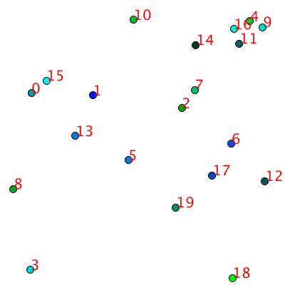

# processing-playground

just playing.

<https://processing.org/>

## Script

### generate_gif.sh

generate a gif file from png images.

If you want to generate a gif of pie_chart directory, you can run the script like the below.

```sh
./generate_gif.sh pie_chart
```

### update_readme.sh

If you want to update this readme with links of generated gif files, you can run the script like the below.

```sh
./update_readme.sh
```

### note 

> We don't yet support any of the Java 7 and Java 8 language features. Please help us fix this. Advanced users (loosely defined as “people who know that these features exist”) can always make use of Java 7 and 8 features from another IDE.
https://github.com/processing/processing/wiki/Supported-Platforms#java-versions


## Gallary

Order of arrival.

Do Not Append texts manually from here.

Execute [update_readme.sh](update_readme.sh) instead of updating manually.

### rotate_line/movie.gif


### flexible_rect/movie.gif


### pie_chart/movie.gif


### shaking_ellipse/movie.gif


### involute_lissajous/movie.gif


### collision/movie.gif



